# 🌊 Flowise: IoT-Based Water Leakage Detection System

Flowise is an end-to-end, real-time IoT-based water leakage detection system designed for modern Water Distribution Systems (WDS). The project combines high-precision hardware sensors, a machine learning classification engine, a Firebase real-time cloud database, and an intuitive mobile dashboard for admins and consumers.

---

## 📐 System Architecture

The system operates across four interconnected layers:

```
  +------------------+       +------------------+       +------------------+
  |  Hardware Node   |  -->  | Firebase RTDB    |  -->  | Python ML Engine |
  | (ESP32 + Sensors)|       | (Realtime Cloud) |  <--  | (XGBoost Infr)   |
  +------------------+       +------------------+       +------------------+
                                      |
                                      v
                             +------------------+
                             | Flutter Mobile   |
                             |  Client App      |
                             +------------------+
```

1. **Hardware Layer (ESP32)**: Collects sensor readings (flow rate and pressure) at regular intervals, formats the data, and writes it directly to the cloud.
2. **Cloud Database (Firebase Realtime Database)**: Serves as the central data bridge, managing raw sensor entries and real-time state flags.
3. **Machine Learning Classifier (Python Cloud Bridge)**: A background server pulling new sensor readings, feeding them into a trained XGBoost classifier (filtering noise via a temporal majority vote), and updating the prediction label in the database.
4. **Mobile Dashboard (Flutter Application)**: An application providing real-time alerts, current system status, and roles for both network administrators and consumers.

---

## 🛠️ Hardware Subsystem

The hardware prototype relies on dual-point measurement nodes to calculate flow and pressure divergence across a distribution pipe section.

### Full Prototype Setup
<p align="center">
  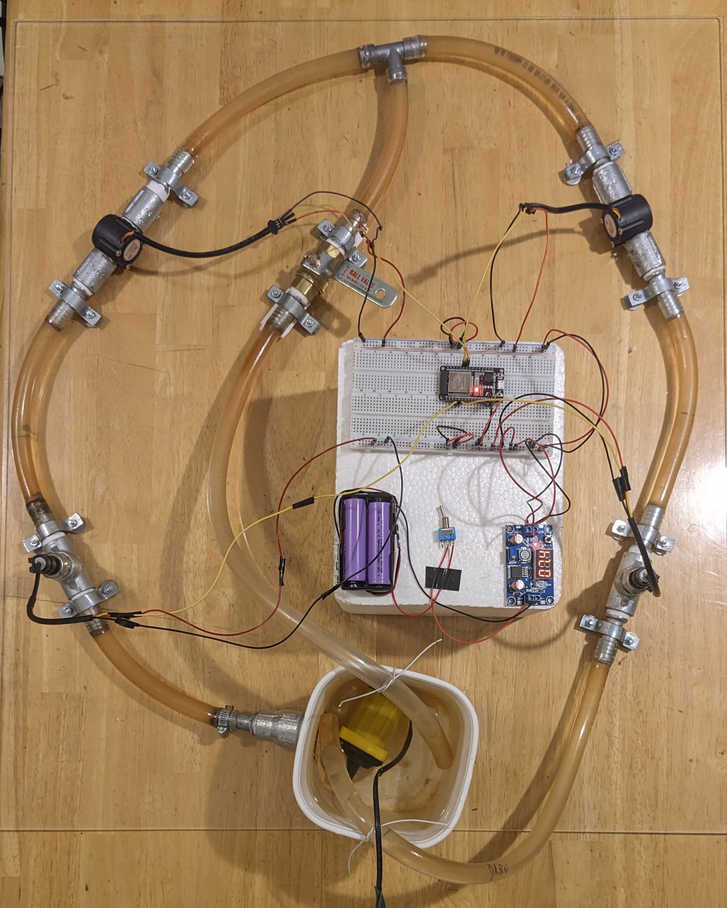
</p>

### Component Breakdown

| Component | Description | Visual Reference |
| :--- | :--- | :---: |
| **ESP32 Node** | The central microcontroller processing sensor pulses and managing WiFi / Firebase connectivity. | 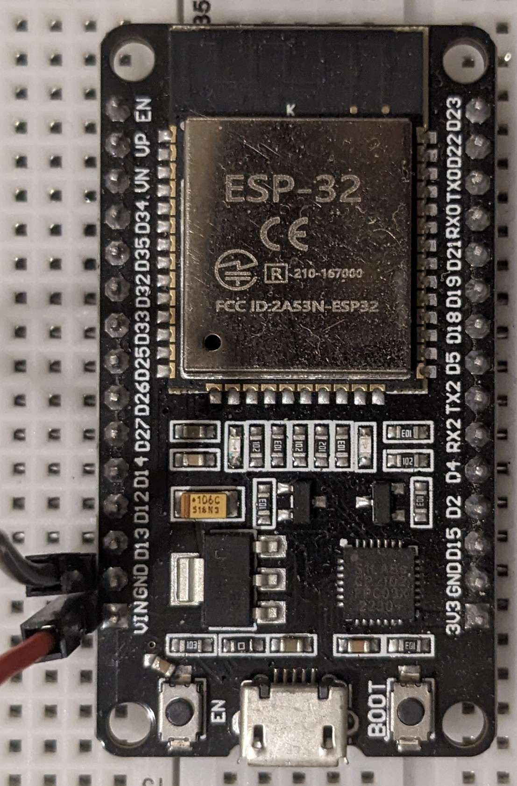 |
| **YF-S201 Flow Sensor** | High-precision sensor calculating volumetric flow using a Hall-effect rotor. | 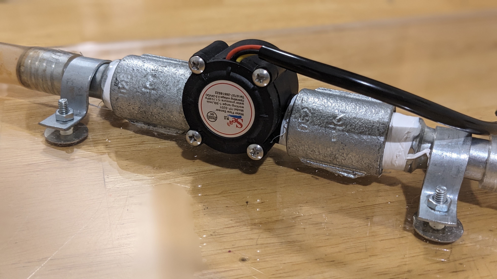 |
| **HK1100C Pressure Sensor** | Analog sensor measuring hydrostatic pressure levels within the pipe. |  |
| **Solenoid Valve** | Electromechanical valve regulating water flow and enabling simulated shutoff controls. | 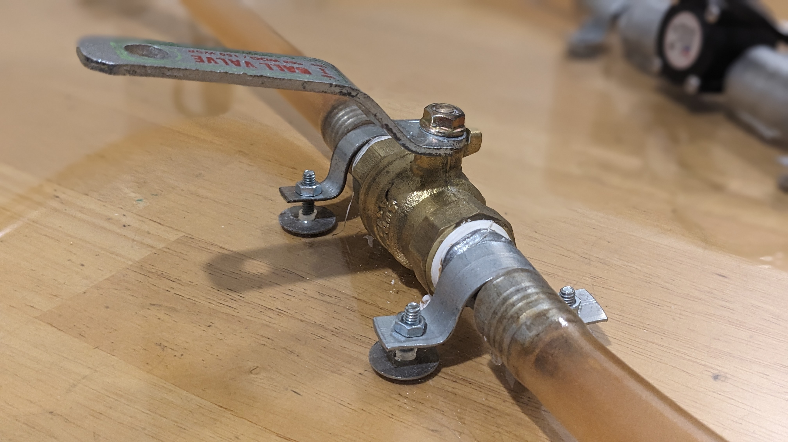 |
| **2S BMS & Power Supply** | Battery management system and power distribution modules ensuring stable voltage supply. | 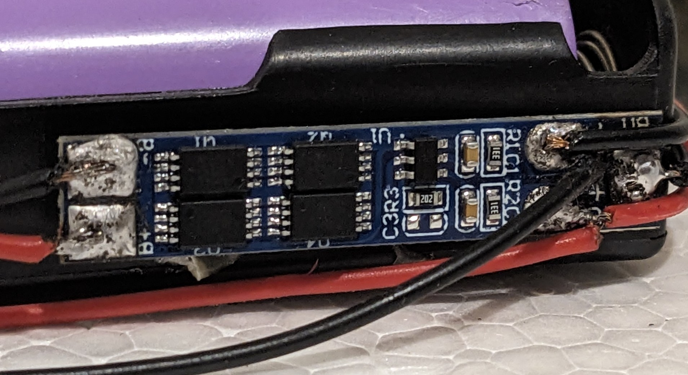<br>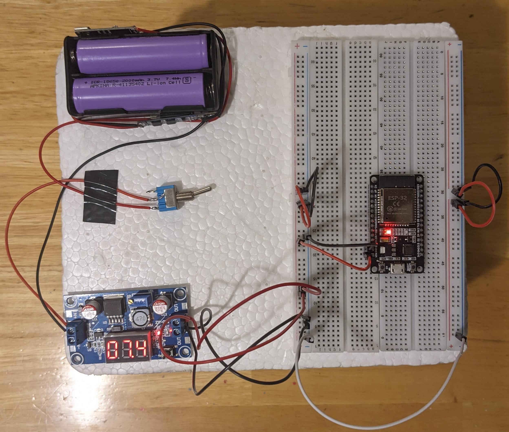 |
| **Voltage Buck Converter** | LM2596 buck converter scaling DC voltage levels to protect microcontrollers. | 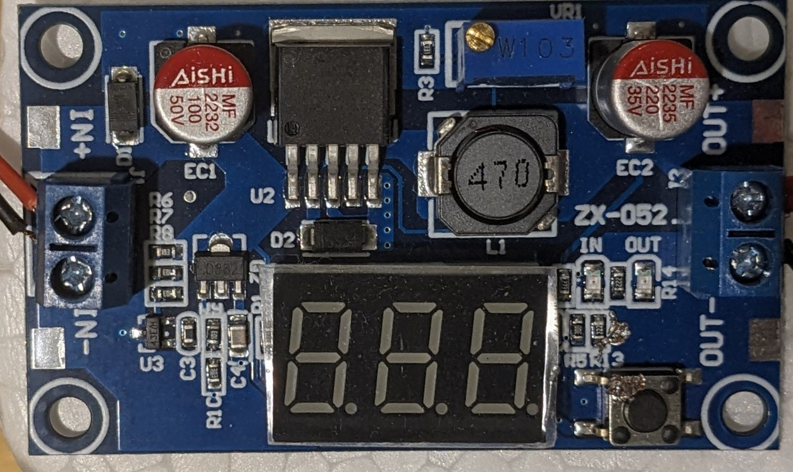 |
| **IP2326 Charger** | Lithium-ion battery charger board ensuring safe, modular portable power. | 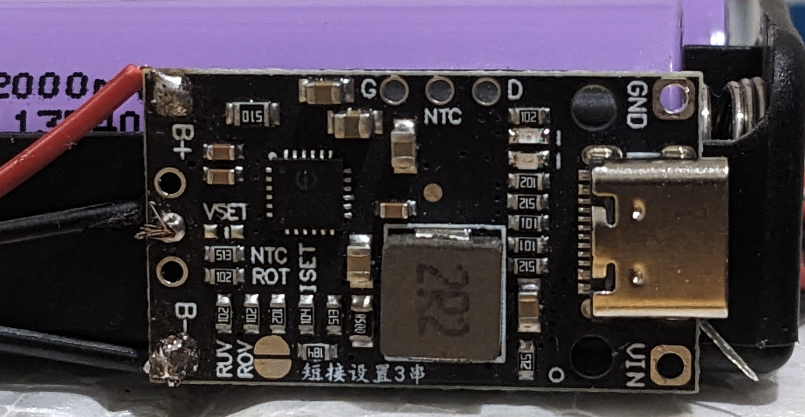 |

### Network Layout
<p align="center">
  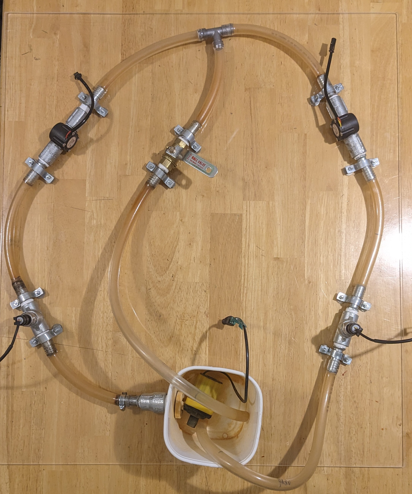
</p>

---

## 📱 Mobile Application

The user interface is built with Flutter and features a responsive glassmorphic design that handles multi-role authentication and delivers push notifications/alerts on leak events.

### Screens Showcase

#### 🔑 Onboarding & Authentication
| Role Selection | Login Screen |
| :---: | :---: |
| 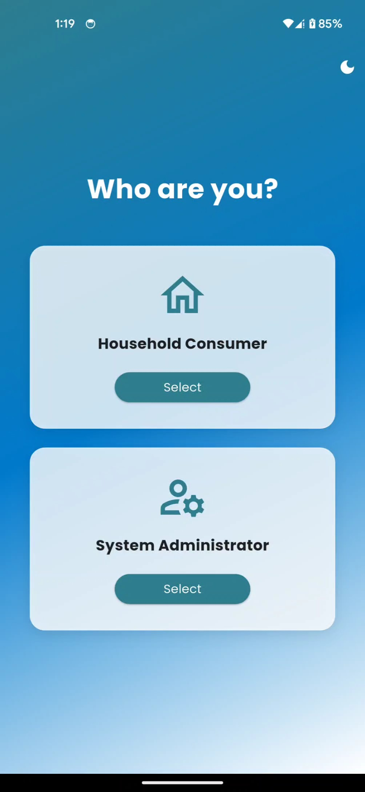 | 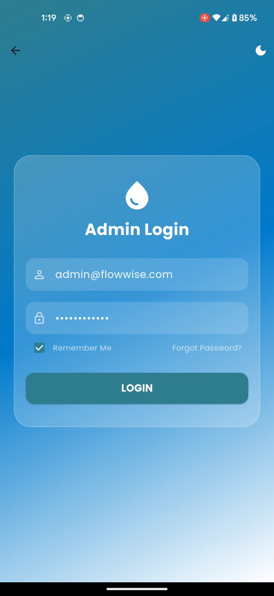 |

#### 🟢 System Status (Secure & Inactive)
| Normal & Secure State | Inactive State | Active Scanning |
| :---: | :---: | :---: |
| 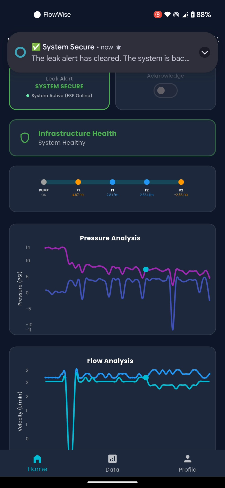 | 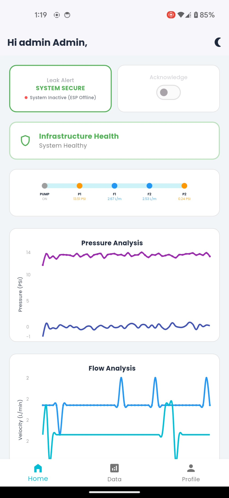 | 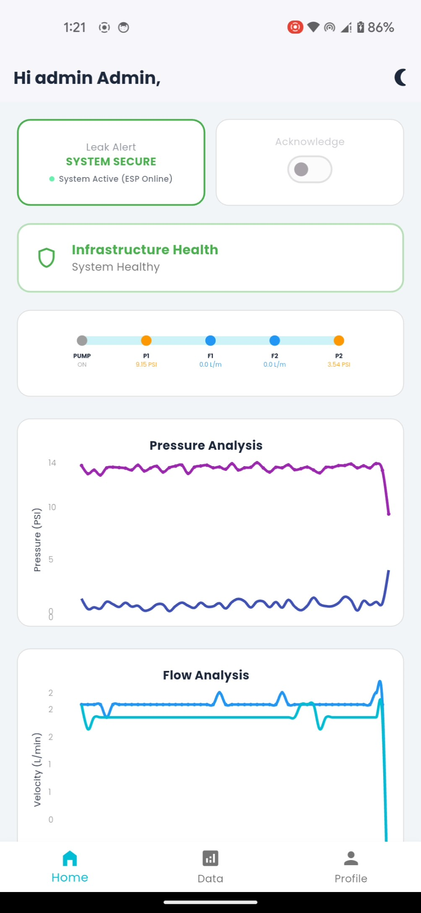 |

#### 🔴 Alert State & Management
| Leak Detected | Alert Acknowledged | Dataset & Telemetry View |
| :---: | :---: | :---: |
| 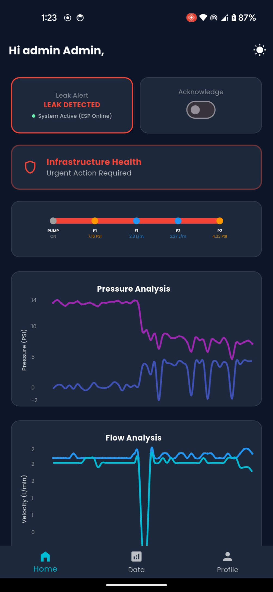 | 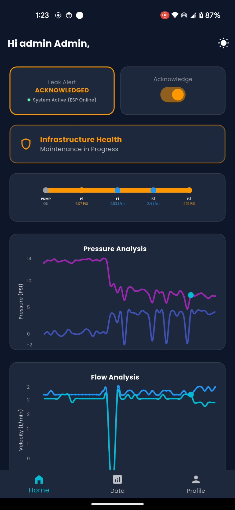 | 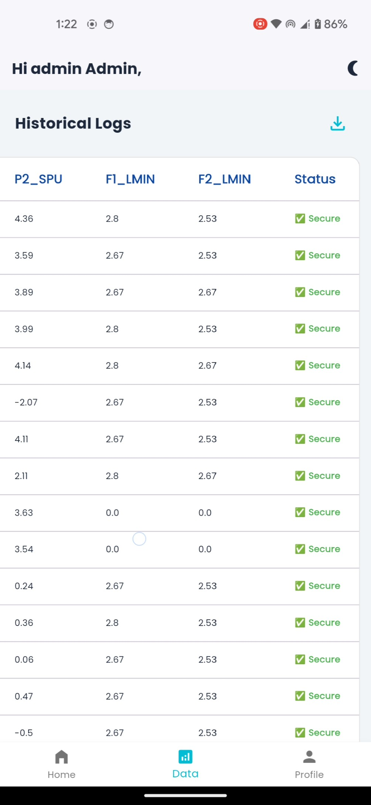 |

---


## ⚙️ Setup & Deployment

### 1. Arduino Hardware Setup
1. Open the [sketch_apr20a.ino](hardware/src/sketch_apr20a/sketch_apr20a.ino) in the Arduino IDE.
2. Create a local `secrets.h` file alongside the sketch with your network credentials and Firebase keys:
   ```cpp
   #define WIFI_SSID "Your_WiFi_Name"
   #define WIFI_PASSWORD "Your_WiFi_Password"
   #define DATABASE_URL "https://your-project-default-rtdb.firebaseio.com"
   #define Web_API_KEY "Your_Firebase_Web_API_Key"
   #define USER_EMAIL "user@example.com"
   #define USER_PASS "your_auth_password"
   ```
3. Connect the ESP32 board and flash the sketch.

### 2. Python ML Engine Backend
1. Navigate to the `cloud_bridge/` directory:
2. Install Python dependencies:
   ```bash
   pip install -r requirements.txt
   ```
3. Configure your local `.env` environment variables:
   ```env
   FIREBASE_KEY_PATH="path/to/firebase-adminsdk-credentials.json"
   DATABASE_URL="https://your-project-default-rtdb.firebaseio.com"
   MODEL_PATH="path/to/xgb_leak_detector_model.json"
   ```
4. Run the engine:
   ```bash
   python leakdetector.py
   ```

### 3. Flutter Mobile Application
1. Navigate to the `mobile_app/` directory.
2. Install dependencies:
   ```bash
   flutter pub get
   ```
3. Run the application:
   ```bash
   flutter run
   ```

---

## 🧠 Machine Learning Details

The system employs an **XGBoost Classifier** to analyze temporal windows (default: 30 seconds) of flow rate and pressure telemetry.
- **Features**: Features include normalized flow rates, flow divergence, flow trends, normalized pressure levels, and pressure divergence trends.
- **Majority Voting**: To prevent false positives from transient hydraulic spikes, the cloud bridge implements a temporal rolling majority vote filter. A leak status is only triggered and flagged if the model registers raw positive detections in at least 3 out of 5 consecutive seconds.
- Jupyter notebooks detailing the synthetic and hardware training workflows can be found in the `ml_engine/` directory.
