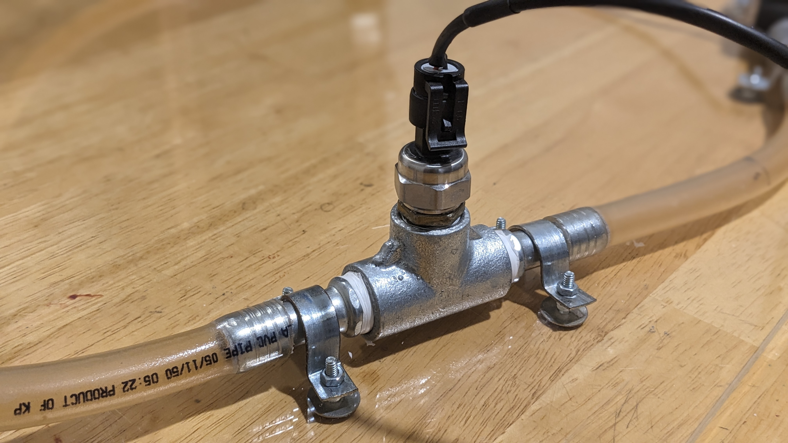
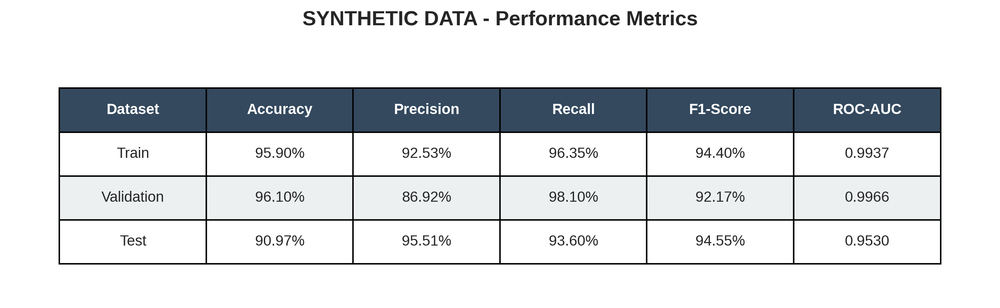
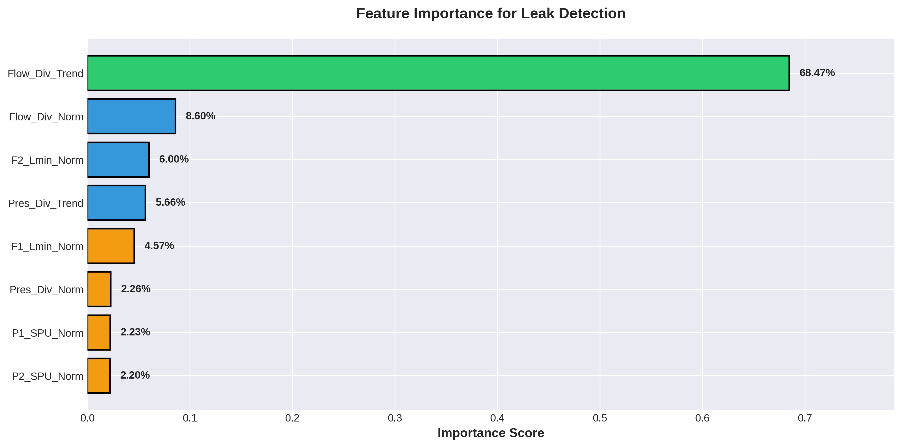
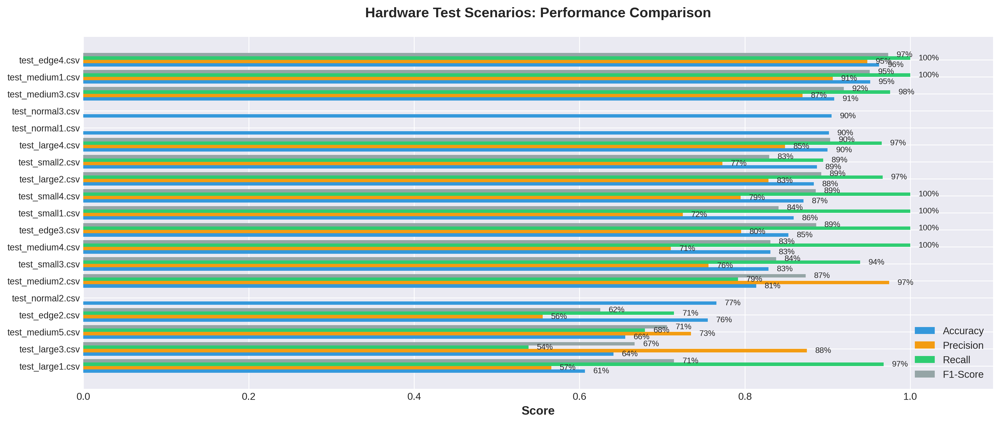
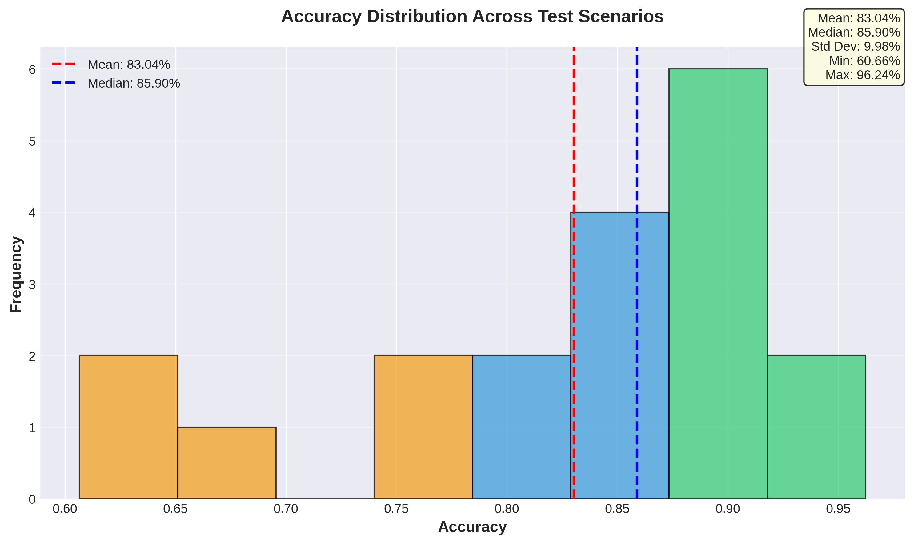
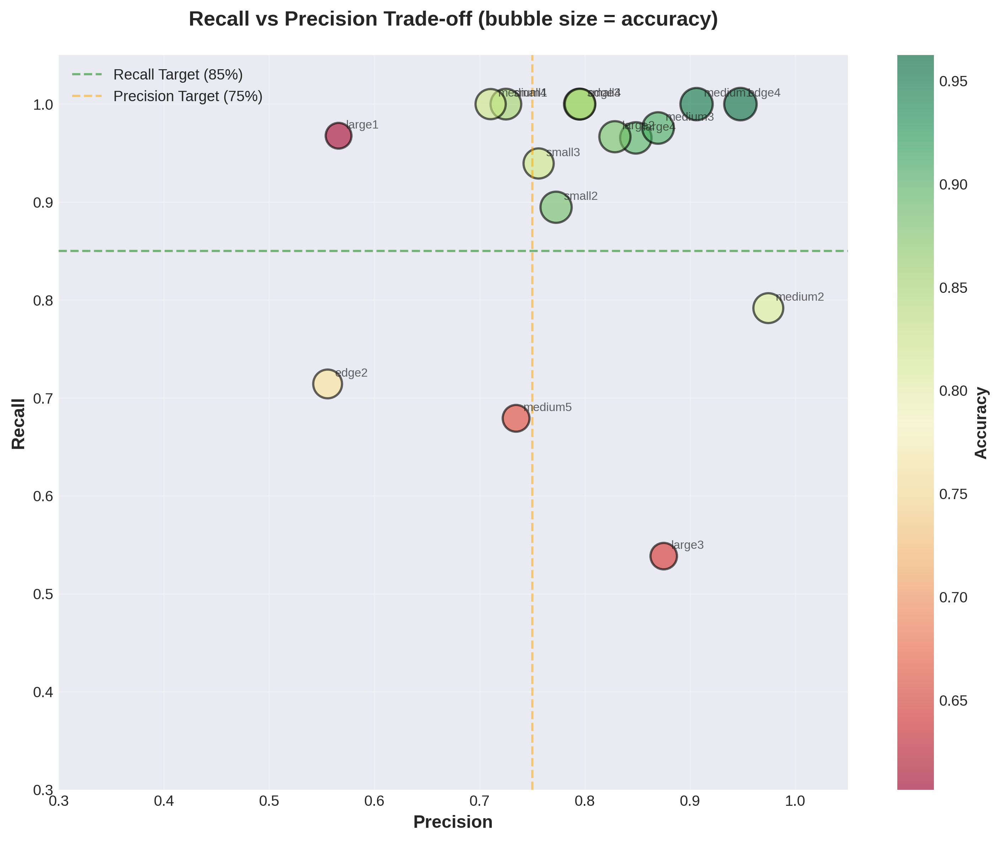
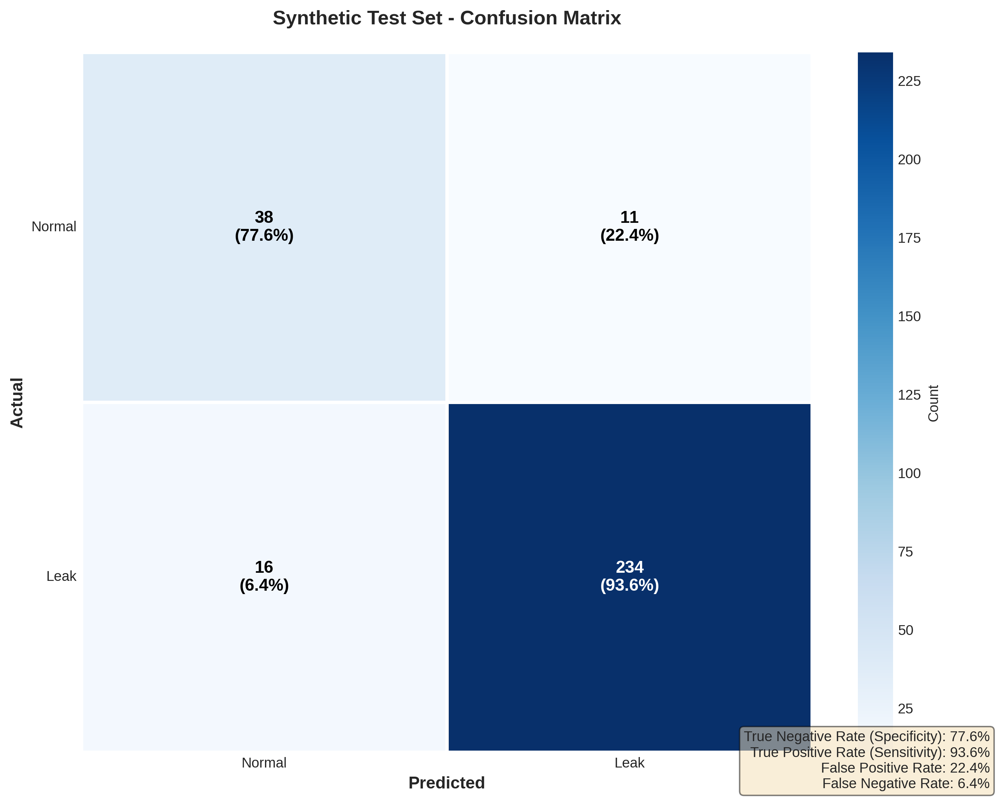
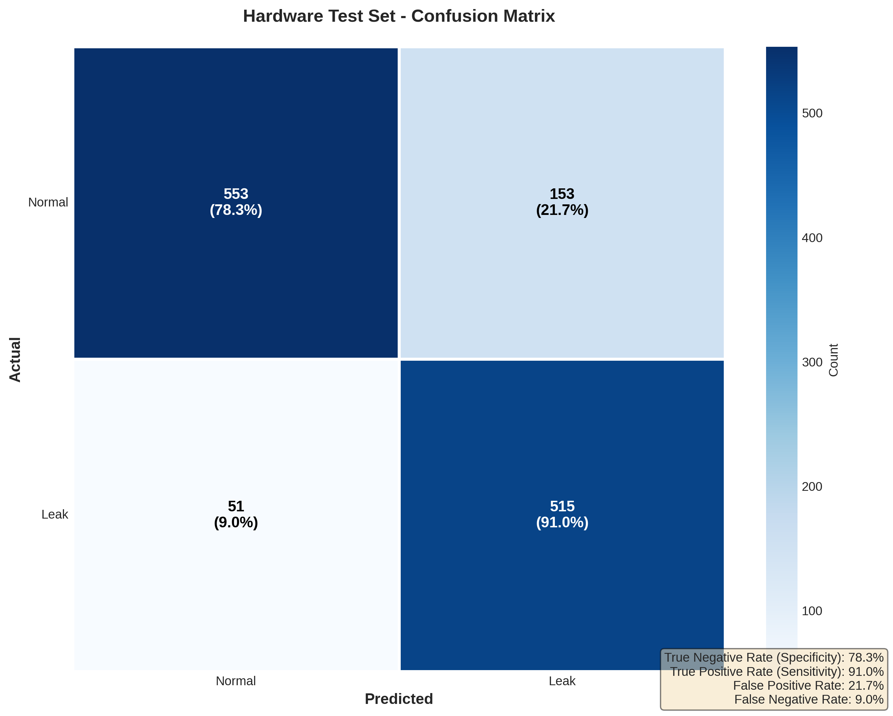
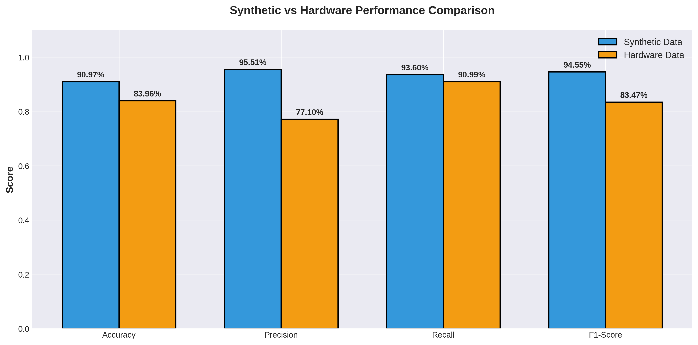
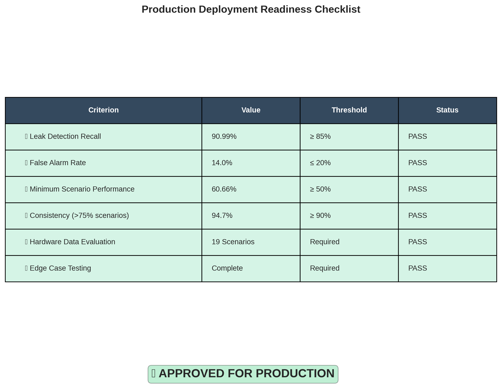

# FLOWISE
## SOLUTION FOR DETECTING AND PREVENTING WATER LEAKS IN PAKISTAN'S URBAN INFRASTRUCTURE

**Sara Khan — 2949**
**Batool Tariq — 2929**

Supervised By
Ms. Quratulain Raja

Submitted for the partial fulfillment of the BS Computer Science degree to the Faculty of Engineering & CS

**DEPARTMENT OF COMPUTER SCIENCE**
**NATIONAL UNIVERSITY OF MODERN LANGUAGES ISLAMABAD**

*January, 2026*

---

## ABSTRACT

Pakistan faces a severe water shortage, and a large portion of treated water is lost in pipeline leakages. FlowWise addresses this issue by introducing an IoT and Machine Learning based leak detection system. The solution captures real-time hydraulic data from a small-scale pipeline prototype using YF-S201 flow sensors and an HK1100C pressure sensor connected to an ESP32. The sensor data is streamed to Firebase and analyzed using a cloud-hosted XGBoost model to detect leak events in real time. 

To ensure reliability on physical hardware, the model is trained on a hardware-matched synthetic dataset and then fine-tuned on real prototype data. The current implementation performs binary leak detection (leak vs. no leak) and provides real-time alerts in a mobile application. Leak localization across multiple pipe segments is reserved for future work.

**Keywords:** Water Scarcity, Pipeline Leakages, Pakistan Pipelines, Leakage Detection, Machine Learning, Internet of Things, XGBoost, Firebase.

---

CHAPTER 1
INTRODUCTION

Water availability in Pakistan has declined drastically, while pipeline losses remain high due to delayed detection and manual inspection processes. Urban pipelines waste 30–40% of supplied water, which makes leak detection a national priority. FlowWise aims to introduce an automated monitoring approach to reduce Non-Revenue Water (NRW) and to provide administrators with timely alerts.

1.1. Project Domain
The project lies at the intersection of IoT and Machine Learning. It focuses on time-series analysis for Smart Water Management using embedded sensors, cloud inference, and mobile alerts.

1.2. Problem Identification
Existing methods in Pakistan rely on manual inspection or delayed reporting. Leaks remain undetected for extended periods, leading to massive water loss, infrastructure damage, and high operational cost.

1.3. Proposed Solution
FlowWise uses a hybrid IoT–ML architecture. The ESP32 reads flow and pressure data from sensors placed along a small-scale PVC pipeline prototype. The data is transmitted to Firebase and analyzed using an XGBoost model that classifies leak events in real time.

1.4. Objectives
• Build an IoT data acquisition system using ESP32, YF-S201 flow sensors, and HK1100C pressure sensor.  
• Generate hardware-matched synthetic training data for model development.  
• Train an XGBoost classifier for real-time binary leak detection.  
• Implement a cloud inference pipeline connected to Firebase.  
• Develop a Flutter-based mobile application for leak alerts.  
• Validate end-to-end performance on a physical prototype.

1.5. Scope of the Project
The system focuses on a small-scale pipeline prototype and supports binary leak detection. Leak localization across multiple segments is not implemented in this version.

1.6. Effectiveness / Usefulness of the System
The system reduces water loss and operational cost by enabling fast detection of leaks. It replaces manual inspection with automated, real-time monitoring.

1.7. Resource Requirements
1.7.1. Hardware Requirements
| Component               | Specification                          | Purpose                              |
|-------------------------|----------------------------------------|--------------------------------------|
| ESP32 Dev Board         | Wi-Fi, dual-core, 240 MHz              | Sensor reading + Firebase telemetry  |
| YF-S201 (×2)            | Hall-effect, 1–30 L/min range          | Inlet and outlet flow measurement    |
| HK1100C                 | Resistive pressure sensor, 0–1.2 MPa  | Pipeline pressure monitoring         |
| PVC Pipeline            | 20 mm diameter, ~1.6 m loop            | Physical testbed                     |
| Manual ball valve       | T-joint mounted                        | Leak simulation                      |

Table 1.1: Hardware Components

1.7.2. Software Requirements
| Tool / Framework            | Purpose                                                    |
|-----------------------------|-------------------------------------------------------------|
| Arduino IDE / PlatformIO    | ESP32 firmware development (C++)                           |
| Firebase Realtime Database  | Real-time data storage and synchronization                 |
| Firebase Authentication     | Secure role-based access for admin users                   |
| Python 3.x (Pandas, NumPy)  | Feature engineering and ML inference engine                |
| XGBoost                     | Leak detection classifier                                  |
| Scikit-learn                | Model evaluation and metrics                               |
| Flutter / Dart              | Cross-platform mobile application (Android Studio)         |
| Kaggle                      | High-memory environment for model training                 |

Table 1.2: Software Tools and Technologies

1.7.3. Data Requirements
The ML model requires training data that matches the behavior of the hardware prototype. Synthetic data is generated using observed baseline flow and pressure values from the prototype and is then fine-tuned using real hardware scenarios.

1.8. Report Organization
Chapter 1 introduces the problem and objectives. Chapter 2 reviews related systems. Chapter 3 outlines requirements. Chapter 4 presents system modeling and hardware design. Chapter 5 explains implementation. Chapter 6 discusses results, testing, and validation. Chapter 7 concludes the work and outlines future improvements.

---

CHAPTER 2
BACKGROUND AND EXISTING SYSTEMS

This chapter reviews the existing research and systems related to leak detection and water monitoring.

2.1. Related Literature Review
Ayamga and Nakpih (2024) proposed iWaLDeL, an IoT-based leak detection system using flow sensors but relied on static thresholds. Gautam et al. (2020) used ML to forecast water consumption but focused only on tanks. Boujelben et al. (2023) achieved high accuracy with acoustic sensing but required expensive hardware and was noise-sensitive.

Table 2.1: Summary of Reviewed Literature
| Paper                      | Method               | Key Finding                           | Limitation                                  |
|----------------------------|----------------------|---------------------------------------|---------------------------------------------|
| Ayamga & Nakpih (2024) [1] | Rule-based, IoT      | Mathematical localization via flow diff | Static logic; no adaptive ML capability   |
| Gautam et al. (2020) [4]   | SVM, ultrasonic      | Accurate consumption forecasting       | Tank-only; no pressurized pipeline support |
| Boujelben et al. (2023) [2]| 1D-CNN, acoustic     | 97% detection accuracy, localization   | Expensive; noise-sensitive; complex data   |

2.2. Related Systems / Applications
Existing solutions use either acoustic sensing, static flow thresholds, or limited ML models. FlowWise improves upon these by combining flow + pressure sensing with a trained ML classifier.

2.3. Identified Problem from Existing Work
• Acoustic systems are costly and noise-sensitive.  
• Flow-sensor systems often lack adaptive intelligence.  
• ML systems are rarely applied to pressurized pipeline leak detection.

2.4. Selected Boundary for Proposed Solution
The system focuses on binary leak detection on a prototype pipeline. Leak localization and large-scale deployment are not included in this version.

---

CHAPTER 3
SYSTEM REQUIREMENT & SPECIFICATIONS

This chapter describes the functional and non-functional requirements of FlowWise.

3.1. Interface Requirements
3.1.1. Hardware Interface Requirements
• ESP32 must support interrupt-driven sensor pulse reading.  
• YF-S201 provides pulse signals proportional to flow.  
• HK1100C provides analog pressure output (0.5–4.5 V).  
• Sampling rate is 1 Hz, with Firebase updates every 2 s.

3.1.2. Software Interface Requirements
• Firebase stores sensor data and labels.  
• Python engine polls Firebase, performs feature engineering, and predicts leaks.  
• Mobile app listens to Firebase and displays alerts.

3.2. Tools and Technologies
ESP32, YF-S201, HK1100C, XGBoost, Firebase, Python, Flutter, Arduino IDE.

3.3. Functional Requirements
3.3.1. Leak Detection Intelligence Module  
Computes rolling-window features and predicts leaks using XGBoost.

3.3.2. IoT Data Acquisition Module  
Captures flow and pressure data with the ESP32 and uploads to Firebase.

3.3.3. Analytics and Notification Module  
Displays real-time flow/pressure charts and sends leak alerts.

3.3.4. Consumer Usage Module  
Provides summarized flow usage metrics for consumers.

3.4. Non-Functional Requirements
• High recall for leak detection.  
• Latency < 10 s end-to-end.  
• Wi-Fi reconnection resilience.  
• Scalable cloud pipeline.  
• Secure and reliable data handling.

3.5. Resource Requirements
Hardware and software resources are listed in Chapter 1 and reused in implementation.

3.6. Project Feasibility
3.6.1. Technical Feasibility  
XGBoost performs well on structured time-series features and supports real-time inference.

3.6.2. Operational Feasibility  
The system runs autonomously, with Firebase as the synchronization layer.

3.6.3. Legal and Ethical Feasibility  
The system supports public safety and reduces water waste.

3.7. Summary
FlowWise requirements ensure reliable data acquisition, classification, and real-time alerting.

---

CHAPTER 4
SYSTEM MODELING & DESIGN

This chapter explains the architecture and hardware design in a top-down manner.

4.1. System Design and Analysis
FlowWise is cloud-centric: ESP32 sends data to Firebase, the inference engine classifies leaks, and the mobile app provides alerts.

4.2. Design Approach
The system follows top-down design. The main goal is leak detection, and the modules are broken into sensing, processing, inference, and user interaction.

4.3. Hardware Prototype Design
The hardware prototype is based on a small PVC pipeline loop with a manual ball valve for leak simulation. Two flow sensors measure inlet/outlet flow, and one pressure sensor measures line pressure. An ESP32 manages sensing and Wi-Fi transmission.

4.4. Hardware Components and Power System
• ESP32-WROOM-32 for processing and Wi-Fi.  
• YF-S201 flow sensors (1–30 L/min).  
• HK1100C pressure sensor (0–1.2 MPa).  
• LM2596 step-down regulator (stable 5V).  
• 2S BMS module for battery safety.  
• IP2326 boost charging IC for 2–3 cell Li-ion charging.

4.5. Wiring and Signal Flow
• YF-S201 pulse output is connected to ESP32 GPIO for interrupt counting.  
• HK1100C analog output is connected to ESP32 ADC.  
• ESP32 operates on 3.3V derived from 5V rail.  
• Data is timestamped and uploaded to Firebase.

4.6. Hardware Prototype Images
Figure 4.1: Prototype pipeline loop and sensor placement.  

Figure 4.2: ESP32 controller and power regulation setup.  

Figure 4.3: Pressure and flow sensor wiring overview.  

4.7. Process View
At runtime, the system performs:  
1. Feature extraction from flow/pressure.  
2. Leak classification with XGBoost.  
3. Firebase label update.  
4. Mobile app notification.

4.8. Summary
Chapter 4 details the overall architecture and the physical prototype used for development and testing.

---

CHAPTER 5
IMPLEMENTATION

This chapter explains how the system was built and integrated.

5.1. Modules of Project
5.1.1. Audio Input Module (Not Applicable)  
This project does not use audio. Input is hydraulic data from flow and pressure sensors.

5.1.2. Data Acquisition Module
• ESP32 captures flow pulses and analog pressure.  
• Data is buffered and sent to Firebase at 2-second intervals.

5.1.3. Feature Engineering Module
Rolling-window normalization is applied over 30 seconds for each feature: flow normalization, flow divergence, pressure normalization, and pressure divergence trend.

5.1.4. Leak Detection Module
XGBoost is trained on 87 synthetic scenarios and fine-tuned using 28 hardware scenarios. Fine-tuning uses a lower learning rate (0.005) and 100 estimators.

5.1.5. Cloud Inference Module
A Python service polls Firebase, computes features, and writes predictions back to Firebase with a majority-vote filter for stable alerts.

5.1.6. Mobile Application Module
Flutter UI subscribes to Firebase. It displays live flow and pressure charts and shows leak alerts when label changes to 1.

5.2. Hardware Module Details
The prototype uses ESP32-WROOM-32, YF-S201 flow sensors, and HK1100C pressure sensor. Power stability is handled using LM2596, IP2326, and a 2S BMS module.

5.3. Training and Fine-Tuning Workflow
• Base dataset: 87 synthetic scenarios.  
• Train/validation/test split: 70% / 20% / 10% (by scenario).  
• Initial training parameters: 150 estimators, max depth 5, learning rate 0.1, tree method hist.  
• Fine-tuning on 28 hardware scenarios with learning rate 0.005 and 100 estimators.

5.4. Evaluation Visualizations
Figure 5.1: Training metrics summary.  

Figure 5.2: Feature importance of trained XGBoost model.  

Figure 5.3: Scenario-wise performance breakdown.  

Figure 5.4: Accuracy distribution across scenarios.  

Figure 5.5: Precision vs. recall scatter plot.  

Figure 5.6: Confusion matrix (synthetic test set).  

Figure 5.7: Confusion matrix (hardware evaluation set).  

Figure 5.8: Synthetic vs. hardware performance comparison.  

Figure 5.9: Deployment readiness summary.  

5.5. Summary
Chapter 5 explained how the modules were implemented, integrated, and evaluated using both synthetic and real hardware datasets.

---

CHAPTER 6
RESULT, TESTING, ANALYSIS AND VALIDATION

This chapter presents the results of model training, fine-tuning, and hardware evaluation.

6.1. Model Training Results
Base test set results after training:  
• Accuracy: 0.9535  
• Precision: 0.9086  
• Recall: 0.9526  
• F1 Score: 0.9300

6.2. Hardware Fine-Tuning Results
Fine-tuning improved real-world adaptation but reduced accuracy due to noise and variance:  
• Accuracy: 0.8252  
• Precision: 0.7909  
• Recall: 0.8698  
• F1 Score: 0.8285

6.3. Hardware Evaluation Summary
Overall hardware evaluation across 19 scenarios:  
• Accuracy: 0.8396  
• Precision: 0.7710  
• Recall: 0.9099  
• F1 Score: 0.8347

Confusion Matrix:
|               | Pred Normal | Pred Leak |
|---------------|-------------|-----------|
| Actual Normal | 553         | 153       |
| Actual Leak   | 51          | 515       |

6.4. Testing Scenarios
Testing covered leak, no-leak, and edge-case scenarios. The system achieved high recall for leak events with moderate false positives in noisy conditions.

6.5. Validation and Observations
• High recall confirms safety-critical leak detection.  
• False positives appear in some normal scenarios and can be reduced with additional tuning.  
• The model is stable enough for deployment in prototype-scale monitoring.

6.6. Summary
FlowWise achieves reliable leak detection in real time with consistent performance on both synthetic and physical datasets.

---

CHAPTER 7
CONCLUSION AND FUTURE WORK

7.1. Brief Review
FlowWise provides an end-to-end IoT-based leak detection system for Pakistan’s urban pipelines. It integrates sensors, Firebase, machine learning inference, and mobile alerts into a unified workflow.

7.2. Achievements
• Built a complete working prototype with real-time telemetry.  
• Trained and fine-tuned an XGBoost model on hardware-matched data.  
• Achieved high recall and reliable alerting in real-time tests.

7.3. Limitations
• Current version only supports binary leak detection.  
• False positives still appear in some normal scenarios.  
• System tested on a single pipeline segment.

7.4. Future Recommendations
• Add leak localization across multiple pipeline segments.  
• Improve dataset diversity and balance.  
• Enhance on-device filtering to reduce noise.  
• Scale to multi-node urban pipeline networks.

7.5. Summary
FlowWise demonstrates that an IoT-ML based monitoring system can reduce water loss through timely leak detection. With further refinements, it can scale to real urban infrastructures.

---

## REFERENCES

[1] M. A. Ayamga and C. I. Nakpih, "An IoT-based water leakage detection and localization system," *Journal of Water Resources and Environmental Engineering*, vol. 17, no. 3, pp. 1–14, 2024.

[2] M. Boujelben et al., "Acoustic leak detection and 2D localization based on non-invasive acoustic sensing and lightweight deep learning," *Measurement*, vol. 218, p. 113189, 2023.

[3] I. Bhatti, "Water crisis worsens in Karachi as supply line bursts," *Dawn*, Jul. 13, 2021. [Online]. Available: https://www.dawn.com/news/1634786.

[4] J. Gautam et al., "Monitoring and forecasting water consumption and detecting leakage using an IoT system," *Water Supply*, vol. 20, no. 3, pp. 1103–1113, 2020.

[5] N. Maqbool, "Pakistan's urban water challenges and prospects," *Pakistan Institute of Development Economics (PIDE)*, Knowledge Brief No. 115, 2024. [Online]. Available: https://file.pide.org.pk/pdfs/KB-115.pdf.

[6] "Water crisis exacerbated amid delays in pipeline repairs," *The Express Tribune*, Apr. 12, 2025. [Online]. Available: https://tribune.com.pk/story/2539426/water-crisis-exacerbated-amid-delays-in-pipeline-repairs.
